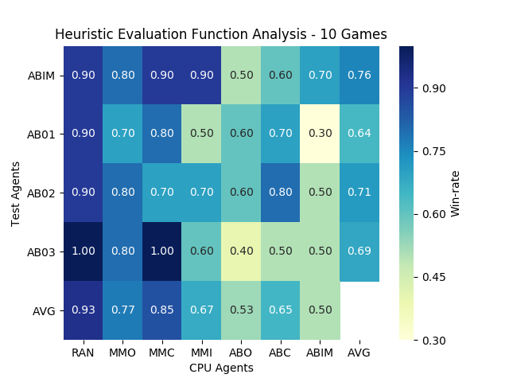

# Introduction 

Isolation is a two-player, zero-sum game of perfect information. Wow what a mouthful. What does that actually mean?

This means deterministic, fully observable environments in which two agents act alternately and in which the utility values at the end of the game are always equal and opposite. For example, if one player wins, the other player loses. It is deterministic in the sense that no randomness is involved, you know the state of the game that will result from your actions given the current state of the game. This is different from games like Poker and Monopoly which are stochastic and involve an element of chance.

In isolation, agents alternate turns moving a single piece from one cell to another on a isolation game board. Whenever either player occupies a cell, that cell becomes blocked for the remainder of the game. The first player with no remaining legal moves loses, and the opponent is declared the winner. It is this opposition between the agents' utility functions that makes the situation adversarial as opposed to co-operative. 

This project uses a version of Isolation where each agent is restricted to L-shaped movements (like a knight in chess) on a rectangular grid (the game board). The agents can move to any open cell on the board that is 2-rows and 1-column or 2-columns and 1-row away from their current position on the board. Movements are blocked at the edges of the board, however, the player can "jump" blocked or occupied spaces (just like a knight in chess).

# Heuristic Evaluation Functions

Just like in professional (human) competitions of Chess and Go, agents are usually restricted to a fixed time limit each turn to search for and implement the optimal move. This is necessary otherwise agents would have enough time to search to the end of the game every time by recursively determining every possible game state for every possible move...now where is the fun in that?  

This is where evaluation functions come in. Heuristic evaluation functions allow us to approximate the true utility of a state without doing a complete search to the end of the game. They act as a measure for the "goodness" of an evaluated move. The closer their value is to the true utility value (which describes whether or not a player has won or lost at the end of the game), the more likely the agent is able to select a move that will result in a win.

The goal of this analysis is to estimate the strength rating of a variety of heuristic evaluation functions for selecting optimal moves for Isolation game playing test-agents. This is summarised by the results a round-robin tournament against a variety of CPU-agents. Test-agents use depth-first alpha-beta search, each with a different evaluation function and CPU-agents are pre-programmed with alternate sample evaluation functions of varying strength.

Each test-agent plays a number of "fair" matches against each CPU-agent.
The matches are fair because the board is initialized randomly for both
players, and the players play each match twice -- once as the first player and
once as the second player.  Randomizing the openings and switching the player
order corrects for imbalances due to both starting position and initiative.

## Game Features

The state of the game at any given moment can be decomposed into a variety of different features which describe how well the game is going for an agent and its opponent. These features, when combined, can be used in evaluation functions to estimate the best moves as shown in the following section(s).

As the game terminates when there is no more possible moves available to an agent, is clearly beneficial for an agent to favour moves which result in it having as many choices for its next move as possible. If an agent resides near the perimeter of the board, the number of possible moves can be dramatically reduced. 

* The number of moves available to player at current board state. $$n$$
* The location of a given player. $$l = (l_x,l_y)$$
* The distance from a given player to the centre of the game board. $$d_{c} = \|l - l_{c}\|$$

However, as the board is square, the Euclidean distance from the centre is not as useful as it would be if the board was circular. The reason for this is due to the fact that an agent in a corner (which would only have a slightly larger $d_c$ value) is in a substantially worse position than an agent at the edge of the board.

* The distance from a given player to the nearest vertex (corner) of the game board. $$d_{v}^{min} = min(\|l - l_{v}\|)$$ 
* The distance from a given player to the nearest edge (side) of the game board. $$d_{e}^{min} = min(\|l - l_{e}\|)$$
* A summary score for a player's legal moves that are located at vertices of the board. $$s_v = \sum^{moves} bool(l_{move} = l_v)$$
* A summary score for a player's legal moves that are located at edges of the board. $$s_e = \sum^{moves} bool(l_{move} = l_e)$$
*  The fraction of the board that is currently not blocked due to previous moves of both players. $$f$$
* A summary score for a player's legal moves that are at on the circumference of the board. $$s_{b} = 10\tau\times(0.7s_v + 0.3s_e)$$ with a tuning factor  $$\tau = \{1, 2, 3\} \{0 < f < 0.50, f > 0.50, f > 0.85\}$$ respectively.

Another promising tactic of successful agents is able to coerce their opponent into positions which offer a sub optimal number of possible future moves. One way to achieve this is to "chase" the opponent by occupying or blocking spaces that the opponent agent would of otherwise been able to move into.

* The distance between a given player and its opponent. $$d_{p} = \|l - l^{\prime}\|$$

N.B. $$\|\sigma - \gamma\|$$ represents the Euclidean distance between two locations on the board, $$\sigma = (\sigma_x, \sigma_y)$$, $$\gamma = (\gamma_x, \gamma_y)$$.

Combing the features of the game board from the perspective of an agent as well as its opponent can capture (almost) twice as much useful information for heuristic evaluation functions.  After all...if the environment is fully observable it makes sense for agents to utilise as much information as possible to make more accurate estimate.

It is for this reason that many of the analysed heuristic evaluation functions involve features from both player's point of view. Features of an opponent player are denoted with the use of primed variables. For instance if $$\beta$$ is feature of a player, $$\beta^{\prime}$$ represents the respective opponent feature.  

## Heuristic Evaluation Function Comparative Analysis

| name | winrate | rank |                           form                           |
|:----:|---------|------|:--------------------------------------------------------:|
| AB01 |         |      |                     $n - n^{\prime}$                     |
| AB02 |         |      |                  $n - \alpha n^{\prime}$                 |
| AB03 |         |      |                   $n^2 - n^{\prime 2}$                   |
| AB04 |         |      |                $n^2 - \alpha n^{\prime 2}$               |
| AB05 |         |      |                   $s_b^{\prime} - s_b$                   |
| AB06 |         |      |         ${s_b^{\prime}}/{n^{\prime}} - {s_b}/{n}$        |
| AB07 |         |      |     $\alpha {s_b^{\prime}}/{n^{\prime}} - {s_b}/{n}$     |
| AB08 |         |      |     $({s_b^{\prime}}/{n^{\prime}})^2 - ({s_b}/{n})^2$    |
| AB09 |         |      | $\alpha ({s_b^{\prime}}/{n^{\prime}})^2 - ({s_b}/{n})^2$ |
| AB10 |         |      |                           $d_c$                          |
| AB11 |         |      |                   $d_c - d_c^{\prime}$                   |
| AB12 |         |      |                $d_c - \alpha d_c^{\prime}$               |
| AB13 |         |      |                          $d_{p}$                         |
| AB14 |         |      |                                                          |

<!-- {{ site.url }}/images/heuristic_plot.png -->

<!-- 
$n - n^{\prime}$
$n - \alpha n^{\prime}$

$n^2 - n^{\prime 2}$
$n^2 - \alpha n^{\prime 2}$
$s_b^{\prime} - s_b$
${s_b^{\prime}}/{n^{\prime}} - {s_b}/{n}$
$\alpha {s_b^{\prime}}/{n^{\prime}} - {s_b}/{n}$
$({s_b^{\prime}}/{n^{\prime}})^2 - ({s_b}/{n})^2$
$\alpha ({s_b^{\prime}}/{n^{\prime}})^2 - ({s_b}/{n})^2$
$d_c$
$d_c - d_c^{\prime}$
$d_c - \alpha d_c^{\prime}$
$d_{p}$
 -->

# Discussion

Reinforcement learning is the way forward

